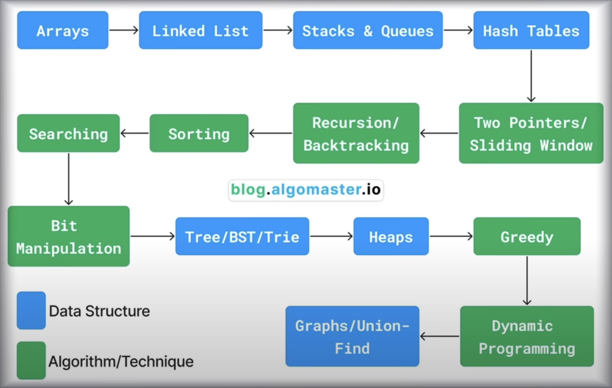

# Notes

## Steps for learning algorithms

1. Understand the problem.
    - WHAT IT IS
2. How It's represented in code
    - HOW IT WORKS
3. Different Operation you can perform on it
    - WHAT IT DOES
4. Time and Space Complexity
    - HOW IT PERFORMS
5. How to implement it in code
    - HOW TO USE IT

## [FreecodeCamp Youtube course](https://www.youtube.com/watch?v=8hly31xKli0)

Algorithms and Data Structures Tutorial - Full Course for Beginners

- Algorithmic Thinking
  - Steps in an algorithm need to be in a specific order
  - The steps need to be distinct
  - The algorithm should produce a result
  - The algorithm should complete in a finite amount of time

- Big O notation
  - Common Run times
    - Constant
    - Linear
    - Logarithmic
    - Quadratic

- Search Algorithms

- Recursion

## Data Structures

- ### Linear Data Structures

  - Arrays
  - Linked Lists
  - Stacks
  - Queues
  - Hash Tables

- ### Non-Linear Data Structures

  - Trees
  - Binary Search Trees
  - Heaps
  - Graphs
  - Tries
  - Union Find

- ## Algorithms

  - Sorting
    - Bubble Sort
    - Selection Sort
    - Insertion Sort
    - Merge Sort
    - Quick Sort
    - Radix Sort
  - Binary Search
  - Bit Manipulation
  - In Order
  - Pre Order
  - Post Order
  - Level Order
  - Depth First Search
  - Breadth First Search
  - Topological Sort
  - Dijkstra's Algorithm
  - Bellman Ford Algorithm

- ## Problem Solving Techniques

  - Two Pointer Technique
  - Sliding Window Technique
  - Prefix sum technique
  - Fast and slow pointers
  - Divide and conquer
  - Greedy algorithms
  - Recursion
  - Backtracking
  - Dynamic programming
  - Top K elements
